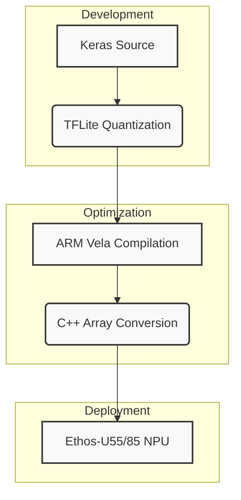

# DeepVOG Light: High-Efficiency Gaze Estimation for Edge AI

## Abstract
DeepVOG Light is a production-optimized convolutional neural network (CNN) designed for real-time eye tracking and gaze estimation on resource-constrained hardware. Specifically engineered for the **ARM Ethos-U NPU** architecture, this repository provides a full-stack toolchain for model development, quantization, and firmware-ready deployment.

---

## Technical Specifications

### Input/Output Interface
*   **Input**: Grayscale Image, 9216 bytes (96 x 96 x 1)
*   **Output**: Multi-objective Regression Head (Eye X, Eye Y Coordinates)
*   **Precision**: Full INT8 Inference (Symmetric Quantization)

### Model Architecture
The network follows a hierarchical feature extraction approach optimized for low-latency inference:
1.  **Spatial Filtering**: Sequential `Conv2D` layers with `ReLU` activation for hierarchical pupil feature mapping.
2.  **Dimensionality Reduction**: `MaxPooling2D` operations interleaved with convolution stages to minimize computational overhead.
3.  **Gaze Regression**: A fully connected `Dense` head providing normalized coordinate predictions.



---

## End-to-End Automation Pipeline
We have integrated a comprehensive automation framework to ensure a seamless "Model-to-Chip" workflow. 

### Pipeline Components
*   `deepvog_light.py`: Defines the foundational Keras model architecture.
*   `convert_deepvog.py`: Implements INT8 post-training quantization (PTQ) to ensure NPU compatibility.
*   `generate_cc.py`: Converts the compiled `.tflite` binary into an embedded C++ source file (`model_data.cc`).
*   `pipeline.ps1`: The primary entry point for lifecycle automation in a Windows environment.

### Deployment Instructions
To execute the unified toolchain, use the provided PowerShell script:
```powershell
.\pipeline.ps1
```

---

## Hardware Integration Guide

### TFLite Micro Implementation
Integration into user firmware is straightforward using the generated `model_data.cc`. Below is a reference implementation for the inference loop:

```cpp
#include "model_data.cc"  // Embedded model data

// Initialize your TFLite Micro Interpreter...
TfLiteTensor* input_tensor = interpreter->input(0);

// Populate input buffer (96x96 grayscale)
for (int i = 0; i < 9216; i++) {
    input_tensor->data.uint8[i] = raw_eye_buffer[i];
}

// Execute Inference
if (interpreter->Invoke() == kTfLiteOk) {
    uint8_t gaze_x = interpreter->output(0)->data.uint8[0];
    uint8_t gaze_y = interpreter->output(0)->data.uint8[1];
    
    // Gaze Results: Normalized coordinates
}
```

---

## Performance Benchmarking (Target: Ethos-U55-128)

| Metric | Measured Value |
| :--- | :--- |
| **Total Inference Cycles** | 115,286 Cycles |
| **System RAM Usage (Peak)** | 176.4 KB |
| **DRAM Staging Size** | 150.9 KB |
| **Flash (Build Size)** | 114.4 KB |

*Data derived from official Vela compilation reports included in the `/output` directory.*

---

## Repository Structure
```text
├── deepvog_light.py    # Keras Model Topology
├── convert_deepvog.py  # INT8 Quantization Logic
├── generate_cc.py      # C-Header Generation Utility
├── pipeline.ps1        # Lifecycle Automation
├── r.txt               # Dependency Manifest
└── output/             # Production Artefacts
    ├── model_data.cc   # Compiled C++ Embedded Source
    ├── *.tflite        # Optimized AI Binary
    └── *.csv           # Performance & Layer Reports
```

---

**Lead Developer**: Mani  
**Platform**: AI for ARM Edge Solutions
