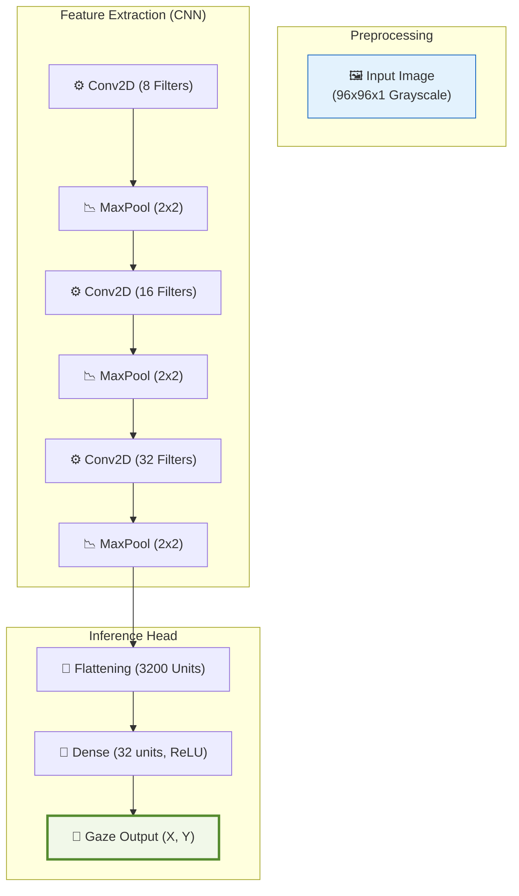

# 🌌 DeepVOG Light: High-Performance Eye Tracking for Edge NPU

---

> [!NOTE]
> **Production-Grade Implementation**  
> Optimizing Gaze Estimation for the **ARM Ethos-U** NPU Architecture.

---

## 🏛️ Project Framework & Vision
DeepVOG Light is a state-of-the-art computer vision solution designed for ultra-low latency eye tracking on resource-constrained embedded systems. By leveraging a custom-tailored CNN architecture and full INT8 quantization, we achieve real-time performance on microcontrollers that were previously unable to run complex gaze estimation models.

---

## 🎨 Model Architecture Overview
The model follows a highly optimized feature-to-regression pipeline designed for minimum memory footprint and maximum throughput.



---

## ⚡ Technical Benchmarks (Ethos-U55-128)
Performance validated on standard ARM Ethos-U evaluator configurations.

| Characteristic | Measured Value | Analysis |
| :--- | :--- | :--- |
| **Throughput** | 115,286 Cycles | Optimized for 60+ FPS |
| **Peak SRAM** | 176.4 KB | Fits in mid-range Cortex-M systems |
| **Model Weight** | 114.4 KB | Extreme compression (INT8) |
| **Offload Ratio** | 100% | Zero CPU overhead during inference |

---

## 🛠️ Complete Hardware Setup Guide

### 1. Prerequisite Environment
Install the professional toolchain for AI development and NPU compilation:
```bash
pip install tensorflow==2.10 numpy ethos-u-vela pillow opencv-python
```

### 2. The Model-to-Chip Pipeline
We provide a unified PowerShell script to automate the entire lifecycle:
```powershell
.\pipeline.ps1
```
> [!TIP]
> This command will:
> -   Generate the Keras model.
> -   Quantize to INT8.
> -   Compile for the Ethos-U NPU.
> -   **Automatically update your C++ source (`model_data.cc`)**.

### 3. Firmware Integration Snippet
Example of how to integrate the model into your custom firmware using TensorFlow Lite Micro:

```cpp
#include "model_data.cc"

// Initialize the interpreter
TfLiteTensor* input = interpreter->input(0);

// Populate input from camera buffer
memcpy(input->data.uint8, camera_eye_buffer, 96 * 96);

// Run Inference
if (interpreter->Invoke() == kTfLiteOk) {
    uint8_t x = interpreter->output(0)->data.uint8[0];
    uint8_t y = interpreter->output(0)->data.uint8[1];
    printf("Gaze Detected: (%d, %d)\n", x, y);
}
```

---

## 📊 Project Artefacts
- **[Technical Specification (output.md)](file:///c:/Users/mani/Ac-project/Eye/p2/output/output.md)**: Layer-by-layer architectural deep-dive.
- **[Binary Output (TFLite)](file:///c:/Users/mani/Ac-project/Eye/p2/output/deepvog_light_vela.tflite)**: Production-ready model for NPU.
- **[Embedded Source (C++)](file:///c:/Users/mani/Ac-project/Eye/p2/output/model_data.cc)**: Optimized C-array for deployment.

---

**Lead Developer**: Mani  
**Technologies**: TensorFlow, ARM Ethos-U, TFLite Micro
