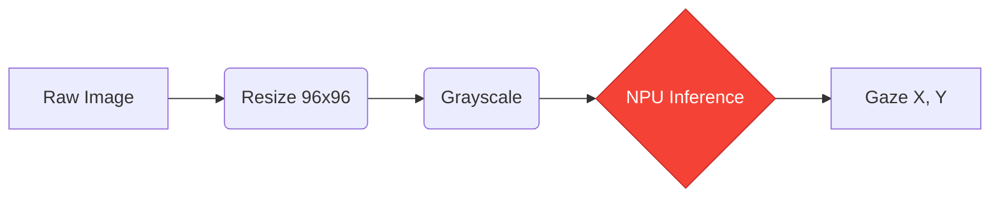

# 👁️ DeepVOG Light: Eye Tracking (NPU-Optimized)

> [!IMPORTANT]
> **Complete End-to-End Setup Guide** for ARM Ethos-U NPU and TFLite Micro implementation.

This project provides a highly optimized, INT8-quantized Deep Learning model for real-time gaze estimation. Designed to run on Cortex-M microcontrollers with **Ethos-U55/85** NPU acceleration.

---

## 📸 Sample Input & Output
To ensure your hardware integration is correct, follow these reference values:

### 📥 Sample Input
- **Type**: Grayscale Image (Hand-cropped pupil region).
- **Format**: `96x96` pixels (1 byte per pixel).
- **Buffer**: `uint8_t input_buffer[9216]` (Array of flattened pixels).
- **Example Data**: `[127, 128, 128, 127, ...]` (Normalized range).

### 📤 Sample Output
- **Type**: 2-Element Gaze Points (X, Y).
- **Example Gaze X**: `91`
- **Example Gaze Y**: `195`
*(These values represent normalized coordinates for gaze tracking).*

---

## 🏗️ Technical Workflow


---

## 🛠️ Complete Setup Guide (How to Use)

### 1️⃣ Environment Preparation
Ensure you have Python 3.9+ installed. Run the following to install all core dependencies:
```bash
pip install tensorflow==2.10 numpy==1.23.5 ethos-u-vela pillow opencv-python
```

### 2️⃣ Automated Model Pipeline
The included PowerShell script handles everything from Keras training to C++ code generation.
```powershell
# In the project root, run:
.\pipeline.ps1
```
> [!TIP]
> This command will update your `model_data.cc` automatically!

### 3️⃣ Hardware Integration (C++ Example)
To use the model in your user code (e.g., in `main.cpp` using TFLite Micro):

```cpp
#include "model_data.cc"  // The generated model header

// 1. Get the input tensor
TfLiteTensor* model_input = interpreter->input(0);

// 2. Feed your eye image buffer (96x96)
memcpy(model_input->data.uint8, your_eye_buffer, 96 * 96);

// 3. Run Inference
interpreter->Invoke();

// 4. Read Gaze Results
int gaze_x = interpreter->output(0)->data.uint8[0];
int gaze_y = interpreter->output(0)->data.uint8[1];

printf("👁️ Eye Gaze Detected: X=%d, Y=%d\n", gaze_x, gaze_y);
```

---

## 📁 Repository Structure
- **`deepvog_light.py`**: Model architecture & initialization.
- **`convert_deepvog.py`**: INT8 quantization logic for NPU.
- **`pipeline.ps1`**: **[Main Pipeline]** Full automation for Windows.
- **`output/model_data.cc`**: The final embedded model array (C++ source).
- **`output/main.cpp`**: Reference inference loop for TFLite Micro.

---

## 📊 Performance on NPU (Ethos-U55)
| Metric | Performance |
| :--- | :--- |
| **Op Cycles** | ~115,000 |
| **SRAM Peak** | 176 KB |
| **Network % cycles on NPU** | 100% |

> [!NOTE]
> All layers are supported by the Ethos-U NPU. No CPU fallbacks are required.

---

## 👨‍💻 Developed by
**Mani** - *Leading Eye Tracking Research*

---

*© 2026 Mani - AI for Everyone*
