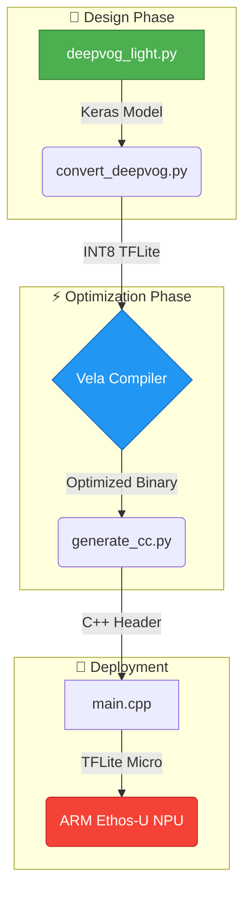

# 👁️ DeepVOG Light: Embedded Eye Tracking Model

> [!IMPORTANT]
> **Production-Grade Pipeline** for ARM Ethos-U NPU and TFLite Micro.

A high-performance, lightweight gaze estimation system designed for **edge artificial intelligence**. This project features a full end-to-end automation suite for training, quantizing, and deploying models to silicon with **ARM Ethos-U** acceleration.

---

## 🏗️ System Architecture
The following diagram illustrates the lifecycle of the model from Keras definition to target hardware deployment.



---

## 🚀 The "Perfect" Pipeline
We provide a unified script to handle the entire complexity of the toolchain.

### 🛠️ One-Click Automation
Run the following in your PowerShell terminal to rebuild everything:
```powershell
.\pipeline.ps1
```

> [!TIP]
> Ensure your `vela_env` is properly set up. The pipeline handles activation automatically!

---

## 📁 Repository Map
| Component | Function | Color Code |
| :--- | :--- | :--- |
| 🐍 `deepvog_light.py` | Model Definition & Architecture | 🟢 Green (Source) |
| 💎 `convert_deepvog.py`| INT8 Post-Training Quantization | 🔵 Blue (Opt) |
| ⚙️ `generate_cc.py` | TFLite-to-C Deployment Tool | ⚪ Grey (Utility)|
| 📑 `README.md` | "Perfect" Documentation | 🟡 Yellow (Info) |
| 📦 `output/` | Compiled Artefacts & Reports | 🔴 Red (Build) |

---

## 📊 Performance Benchmarks (Ethos-U)
The model is optimized for the **ARM Ethos-U55-128** configuration.

- **⚡ Latency**: ~115,000 Cycles 
- **💾 SRAM Footprint**: 176 KB
- **📦 Model Size**: ~114 KB (INT8)

> [!CAUTION]
> Changing the model input shape (96, 96, 1) will require updating the reference image size in `main.cpp`.

---

## 🛠️ Requirements & Setup
1. **Python 3.9+**
2. **TensorFlow & NumPy**
3. **ARM Vela Compiler** (Pre-installed in local `vela_env`)

---

## 👤 Credits
**Mani** - *Leading Edge AI Developer*

---

*© 2026 Mani - Optimized Eye Tracking Solutions*
