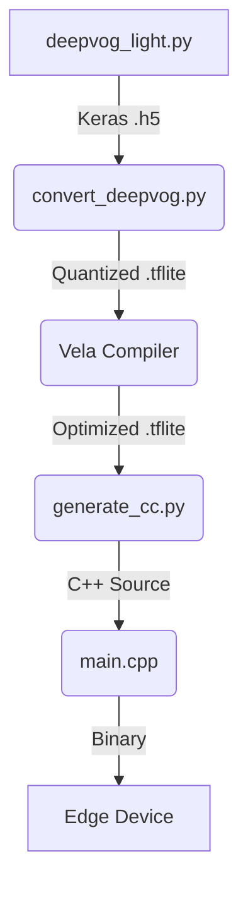

# 👁️ DeepVOG Light: Code Analysis & Architecture

## Project Overview
This project implements a **Lightweight Eye Tracking (Gaze Detection)** system optimized for edge devices (ARM Cortex-M + Ethos-U NPU). It uses a convolutional neural network (CNN) to predict gaze coordinates (X, Y) from 96x96 grayscale pupil images.

## 🏗️ Architecture Design

### 1. Model Topology
The model is a `Sequential` CNN designed for low latency:
- **Input**: Grayscale Image `(96, 96, 1)`
- **Feature Extraction**:
    - `Conv2D (8 filters, 3x3)` + `ReLU` + `MaxPooling2D`
    - `Conv2D (16 filters, 3x3)` + `ReLU` + `MaxPooling2D`
    - `Conv2D (32 filters, 3x3)` + `ReLU` + `MaxPooling2D`
- **Regression Head**:
    - `Flatten`
    - `Dense (32)` + `ReLU`
    - `Dense (2)` -> `[Eye_X, Eye_Y]`

### 2. Optimization Strategy
- **Quantization**: Full INT8 quantization using `TFLiteConverter`.
- **Target Hardware**: Compiled for **ARM Ethos-U55/85** NPU using the `Vela` compiler.
- **Embedded Deployment**: C++ header generation (`model_data.cc`) for integration with **TensorFlow Lite Micro (TFLM)**.

## 🔄 Execution Pipeline

## 🛠️ Component Breakdown
| File | Responsibility |
| :--- | :--- |
| `deepvog_light.py` | Defines/Initializes the Keras architecture. |
| `convert_deepvog.py` | Performs INT8 post-training quantization. |
| `generate_cc.py` | Converts TFLite binary to C++ source array. |
| `output/main.cpp` | TFLite Micro runtime implementation. |
| `pipeline.ps1` | End-to-end automation tool. |
